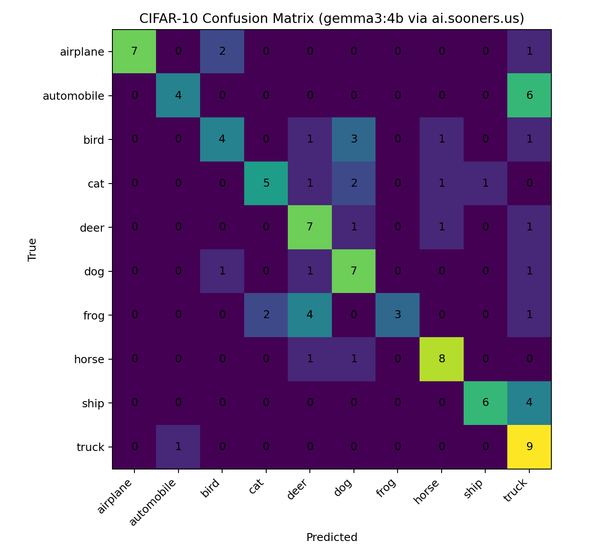
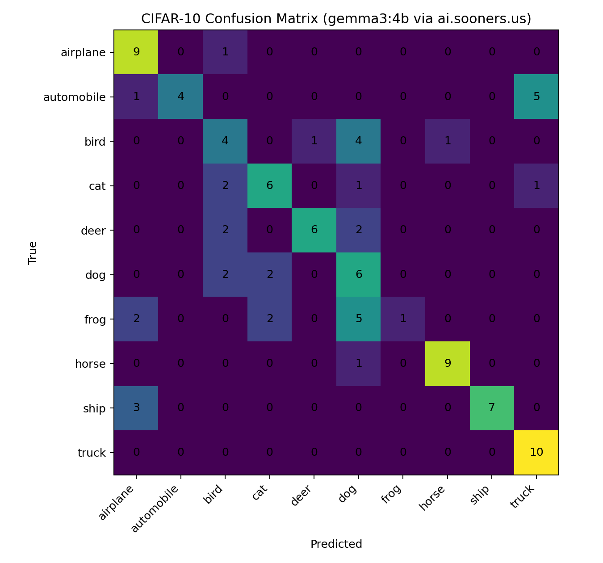
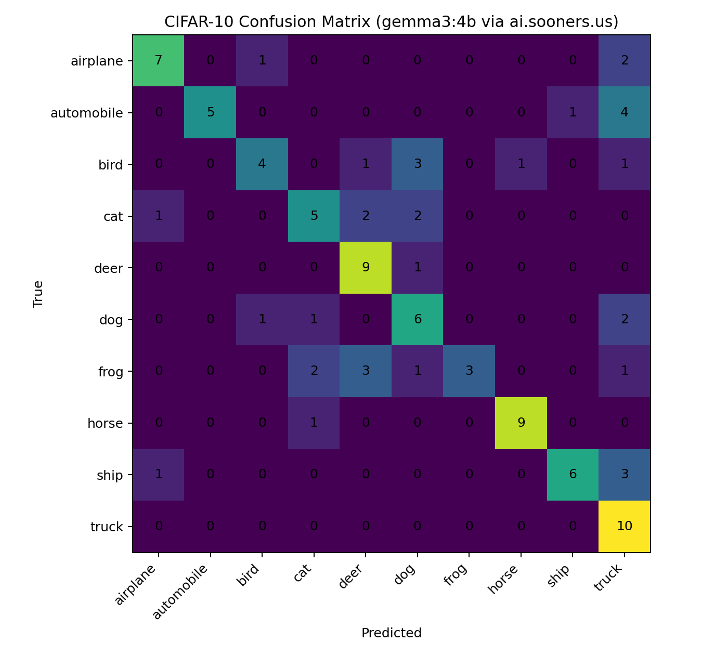

# CIFAR-10 Classification using `gemma3:4b` (ai.sooners.us)

This project uses an OpenAI-compatible Vision-Language Model (VLM) endpoint at [https://ai.sooners.us](https://ai.sooners.us) to classify 100 sampled images from the CIFAR-10 dataset.  
Each image (32×32 RGB) was sent as base64 to `/api/chat/completions` with different **system prompts** to measure the effect of prompt engineering on accuracy.

---

## Setup

1. **Environment file**

   Create `~/.soonerai.env`:
   ```bash
   SOONERAI_API_KEY=your_key_here
   SOONERAI_BASE_URL=https://ai.sooners.us
   SOONERAI_MODEL=gemma3:4b
   ```

2. **Install dependencies**
   ```bash
   python -m venv cifar-env
   source cifar-env/bin/activate     # (or Scripts\activate on Windows)
   pip install requests python-dotenv torch torchvision pillow scikit-learn matplotlib
   ```

3. **Run classification**
   ```bash
   python cifar10_classify.py
   ```

---

## Sampling

A stratified sample of 100 training images (10 per class) was drawn using a fixed random seed (1337) for reproducibility.  
Each image was resized to 224×224 before encoding to base64 to better match the VLM’s expected input size.

---

## Experiments and Results

| **Prompt ID** | **System Prompt Summary** | **Accuracy** | **Confusion Matrix** |
|----------------|----------------------------|--------------|----------------------|
| **Prompt A** (Baseline – *empty system prompt*) | No system message; relied only on user instruction “Respond with exactly one label…” | **64 %** |  |
| **Prompt B** (Descriptive context) | “You are an image classification assistant… focus on shape, texture, color…” | **60 %** |  |
| **Prompt C** (Strict classification rules + disambiguation hints) | “STRICT MODE: classify one CIFAR-10 image; allowed labels… wings→airplane; floppy ears→dog; output one lowercase label only.” | **62 %** |  |

---

## Analysis

- The **baseline (Prompt A)** achieved the highest accuracy (64 %) despite having no system prompt.  
  It benefited from a very restrictive user instruction that forced one-word answers.  
- Adding **general context (Prompt B)** reduced accuracy (60 %)—the model likely interpreted the task more loosely as a conversational assistant rather than a classifier.  
- The **strict and hint-based prompt (Prompt C)** recovered some performance (62 %), showing that clear constraints and short outputs help VLMs maintain focus.  
- Frequent confusions included **bird ↔ airplane**, **cat ↔ dog**, and **ship ↔ truck**, typical for low-resolution CIFAR-10 images.

Overall, **concise, rule-driven prompts** worked best for this model, while verbose or descriptive ones hurt accuracy.

---

## Security and Reproducibility

- The API key is loaded from `~/.soonerai.env` (not committed).  
- All random sampling uses a fixed seed (`SEED = 1337`).  
- Misclassification details are logged in `misclassifications-prompt-X.jsonl` for audit and reproducibility.

---

**Deliverables**
- `cifar10_classify.py`
- `confusion_matrix-prompt-A.png`, `confusion_matrix-prompt-B.png`, `confusion_matrix-prompt-C.png`
- `misclassifications-prompt-A.jsonl`, etc.
- `README.md` (this file)
